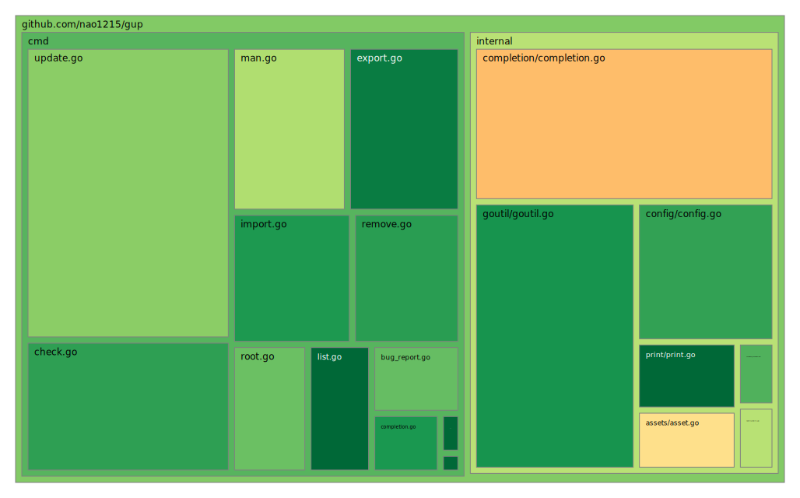

## Contributing to gup
Thank you for building gup with us.
Every report, patch, test, and review directly improves the daily workflow of Go developers.
Let's keep gup fast, safe, and reliable together.

## Contributing as a Developer
### 1. Start with clear communication
- Bug report: Use the issue template and include reproducible steps, expected behavior, and actual behavior.
- New feature: Open an issue first so we can agree on direction before implementation.
- Bug fix or improvement: Open a PR with a clear problem statement and solution summary.

### 2. Keep the quality bar high
- Add or update unit tests when you add features or fix bugs.
- Avoid regressions on supported OSes (Linux, macOS, Windows).
- Keep CLI behavior and error messages clear and consistent.

### 3. Run checks before opening a PR
```shell
make test
make vet
make fmt
make coverage-tree
```

`coverage-tree` generates the test treemap shown below.



### 4. Run the end-to-end tests (optional but recommended for CLI changes)
gup has an offline end-to-end suite that exercises the real `gup` binary and the
real `go` toolchain against a self-contained module proxy, all inside a throwaway
temp tree. It never touches your real `$HOME`, `~/.config/gup`, or `$GOBIN`, and
needs no network access. The suite uses [ShellSpec](https://github.com/shellspec/shellspec).

```shell
# Install ShellSpec once (see https://github.com/shellspec/shellspec#installation)
curl -fsSL https://raw.githubusercontent.com/shellspec/shellspec/0.28.1/install.sh | sh -s 0.28.1 --yes

# Run the whole offline suite
make e2e
```

The harness lives under `e2e/`: `e2e/run.sh` builds gup, starts the offline
module proxy (`e2e/testproxy`), and runs the ShellSpec specs in `e2e/spec/`. The
same `make e2e` command runs in CI (`.github/workflows/e2e.yml`).

### 5. Manage developer tools with Go tool declarations
gup manages helper tools via `go.mod` `tool` entries.
Use the command below to add or update tool dependencies:

```shell
make update-tools
```

## Documentation and translations
`README.md` (English) is the **source of truth** for user-facing documentation.
Translated READMEs live under `doc/<lang>/README.md` (`ja`, `es`, `fr`, `ko`,
`ru`, `zh-cn`).

When you change `README.md`:

- Update the translated READMEs for the affected sections, **or** leave them as
  is — every translation carries a "this translation may lag behind English"
  banner (marked with the `<!-- gup:translation-sync -->` comment) so readers
  know where the latest information lives.
- Keep the English README's first-class sections intact. A CI test
  (`doc_sync_test.go`) enforces that `README.md` keeps its required sections and
  that every translated README keeps the sync banner and a link back to English.
- Run `make test` so `doc_sync_test.go` runs before you open the PR.

## Contributing Outside of Coding
You can still make a huge impact even if you are not writing code:

- Give gup a GitHub Star
- Share gup with your team and community
- Open issues with clear reproduction steps
- Sponsor the project
