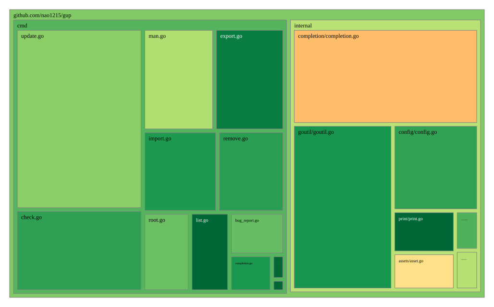

## Contributing to gup
Thank you for building gup with us.
Every report, patch, test, and review directly improves the daily workflow of Go developers.
Let's keep gup fast, safe, and reliable together.

## Contributing as a Developer
### 1. Start with clear communication
- Bug report: Use the issue template and include reproducible steps, expected behavior, and actual behavior.
- New feature: Open an issue first so we can agree on direction before implementation.
- Bug fix or improvement: Open a PR with a clear problem statement and solution summary.

### 2. Keep the quality bar high
- Add or update unit tests when you add features or fix bugs.
- Avoid regressions on supported OSes (Linux, macOS, Windows).
- Keep CLI behavior and error messages clear and consistent.

### 3. Run checks before opening a PR
```shell
make test
make vet
make fmt
make coverage-tree
```

`coverage-tree` generates the test treemap shown below.



### 4. Run the end-to-end tests (optional but recommended for CLI changes)
gup has an offline end-to-end suite that exercises the real `gup` binary and the
real `go` toolchain against a self-contained module proxy, all inside a throwaway
temp tree. It never touches your real `$HOME`, `~/.config/gup`, or `$GOBIN`, and
needs no network access. The tests are plain-YAML specs run by
[atago](https://github.com/nao1215/atago).

The suite uses atago **v0.3.4+** features (a real-PTY step for the interactive
`gup remove` prompt, and golden-output snapshots), so an older atago will fail to
parse those specs. CI pins the same version via setup-atago.

```shell
# Install atago once (v0.3.4 or newer)
go install github.com/nao1215/atago@latest

# Run the whole offline suite
make e2e

# Refresh golden snapshots after an intentional output change
atago run --update-snapshots e2e/atago
```

The harness lives under `e2e/`: `e2e/run.sh` builds gup, starts the offline
module proxy (`e2e/testproxy`), and runs the atago specs in `e2e/atago/`. The
same `make e2e` command runs in CI (`.github/workflows/e2e.yml`), where atago
is installed by [setup-atago](https://github.com/nao1215/setup-atago).

### 5. Manage developer tools with Go tool declarations
gup manages helper tools via `go.mod` `tool` entries.
Use the command below to add or update tool dependencies:

```shell
make update-tools
```

## Documentation
`README.md` (English) is the only user-facing documentation file in the
repository; the [documentation website](https://nao1215.github.io/gup/) is built
from `website/`. gup used to carry translated READMEs under `doc/<lang>/`, but
they drifted behind English faster than they could be maintained, so they were
removed — English is the single source of truth.

When you change `README.md`:

- Keep the first-class sections intact. A CI test (`doc_sync_test.go`) enforces
  that `README.md` keeps its required sections, that each section still carries
  its commands and links, and that the install commands are current.
- Run `make test` so `doc_sync_test.go` runs before you open the PR.

## Releasing
Maintainers cut releases by pushing a `v*` tag. The process is documented in
[doc/RELEASE.md](./doc/RELEASE.md).

## Need help?
See [SUPPORT.md](./.github/SUPPORT.md) for where to ask questions and report problems.

## Contributing Outside of Coding
You can still make a huge impact even if you are not writing code:

- Give gup a GitHub Star
- Share gup with your team and community
- Open issues with clear reproduction steps
- Sponsor the project
