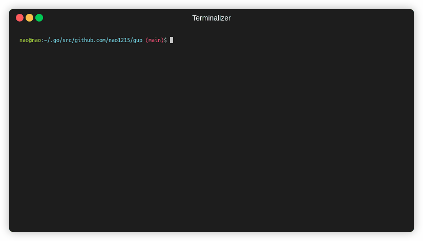

[](https://github.com/avelino/awesome-go)
[](https://github.com/nao1215/gup/actions/workflows/multi_ver_unittest.yml)
[](https://github.com/nao1215/gup/actions/workflows/windows_test.yml)
[](https://github.com/nao1215/gup/actions/workflows/mac_test.yml)
[](https://github.com/nao1215/gup/actions/workflows/linux_test.yml)
[](https://github.com/nao1215/gup/actions/workflows/freebsd.yml)
[](https://github.com/nao1215/gup/actions/workflows/openbsd.yml)
[](https://github.com/nao1215/gup/actions/workflows/dragonfly.yml)
[](https://github.com/nao1215/gup/actions/workflows/reviewdog.yml)

[](https://github.com/nao1215/gup/actions/workflows/govulncheck.yml)
[](https://github.com/nao1215/gup/actions/workflows/security.yml)
[](https://pkg.go.dev/github.com/nao1215/gup)
[](https://goreportcard.com/report/github.com/nao1215/gup)

[[日本語](./doc/ja/README.md)]

# gup - Update binaries installed by "go install"


**gup** command update binaries installed by "go install" to the latest version. gup updates all binaries in parallel, so very fast. It also provides subcommands for manipulating binaries under \$GOPATH/bin (\$GOBIN). It is a cross-platform software that runs on Windows, Mac and Linux.

If you are using oh-my-zsh, then gup has an alias set up. The alias is `gup - git pull --rebase`. Therefore, please make sure that the oh-my-zsh alias is disabled (e.g. $ \gup update).


## Supported OS (unit testing with GitHub Actions)
- Linux
- Mac
- Windows
- FreeBSD
- OpenBSD
- DragonflyBSD

The gup command may work in a NetBSD environment, but we have not been able to run Unit Test with GitHub Actions. Therefore, it is removed from the supported operating systems.

## How to install
### Use "go install"
If you does not have the golang development environment installed on your system, please install golang from the [golang official website](https://go.dev/doc/install).
```
$ go install github.com/nao1215/gup@latest
```

### For Mac user
```
$ brew tap nao1215/tap
$ brew install nao1215/tap/gup
```

### Install from Package or Binary
[The release page](https://github.com/nao1215/gup/releases) contains packages in .deb, .rpm, and .apk formats. gup command uses the go command internally, so the golang installation is required.


## How to use
### Update all binaries
If you update all binaries, you just run `$ gup update`.

```
$ gup update
gup:INFO : update binary under $GOPATH/bin or $GOBIN
gup:INFO : [ 1/30] github.com/cheat/cheat/cmd/cheat (Already up-to-date: v0.0.0-20211009161301-12ffa4cb5c87)
gup:INFO : [ 2/30] fyne.io/fyne/v2/cmd/fyne_demo (Already up-to-date: v2.1.3)
gup:INFO : [ 3/30] github.com/nao1215/gal/cmd/gal (v1.0.0 to v1.2.0)
gup:INFO : [ 4/30] github.com/matsuyoshi30/germanium/cmd/germanium (Already up-to-date: v1.2.2)
gup:INFO : [ 5/30] github.com/onsi/ginkgo/ginkgo (Already up-to-date: v1.16.5)
gup:INFO : [ 6/30] github.com/git-chglog/git-chglog/cmd/git-chglog (Already up-to-date: v0.15.1)
   :
   :
```

### Update the specified binary
If you want to update only the specified binaries, you specify multiple command names separated by space.
```
$ gup update subaru gup ubume
gup:INFO : update binary under $GOPATH/bin or $GOBIN
gup:INFO : [1/3] github.com/nao1215/gup (v0.7.0 to v0.7.1)
gup:INFO : [2/3] github.com/nao1215/subaru (Already up-to-date: v1.0.2)
gup:INFO : [3/3] github.com/nao1215/ubume/cmd/ubume (Already up-to-date: v1.4.1)
```

### Exclude binaries during gup update
If you don't want to update some binaries simply specify binaries which should not be updated separated using ',' without spaces as a delimiter.
Also works in combination with --dry-run
```
$ gup update --exclude=gopls,golangci-lint    //--exclude or -e, this example will exclude 'gopls' and 'golangci-lint'
```

### Update binaries with @main or @master
If you want to update binaries with @master or @main, you can specify the -m or --master option.
```
$ gup update --main=gup,lazygit,sqly
```

### List up command name with package path and version under $GOPATH/bin
list subcommand print command information under $GOPATH/bin or $GOBIN. The output information is the command name, package path, and command version.


### Remove the specified binary
If you want to remove a command under $GOPATH/bin or $GOBIN, use the remove subcommand. The remove subcommand asks if you want to remove it before removing it.
```
$ gup remove subaru gal ubume
gup:CHECK: remove /home/nao/.go/bin/subaru? [Y/n] Y
gup:INFO : removed /home/nao/.go/bin/subaru
gup:CHECK: remove /home/nao/.go/bin/gal? [Y/n] n
gup:INFO : cancel removal /home/nao/.go/bin/gal
gup:CHECK: remove /home/nao/.go/bin/ubume? [Y/n] Y
gup:INFO : removed /home/nao/.go/bin/ubume
```

If you want to force the removal, use the --force option.
```
$ gup remove --force gal
gup:INFO : removed /home/nao/.go/bin/gal
```

### Check if the binary is the latest version
If you want to know if the binary is the latest version, use the check subcommand. check subcommand checks if the binary is the latest version and displays the name of the binary that needs to be updated.
```
$ gup check
gup:INFO : check binary under $GOPATH/bin or $GOBIN
gup:INFO : [ 1/33] github.com/cheat/cheat (Already up-to-date: v0.0.0-20211009161301-12ffa4cb5c87)
gup:INFO : [ 2/33] fyne.io/fyne/v2 (current: v2.1.3, latest: v2.1.4)
   :
gup:INFO : [33/33] github.com/nao1215/ubume (Already up-to-date: v1.5.0)

gup:INFO : If you want to update binaries, the following command.
           $ gup update fyne_demo gup mimixbox
```

Like other subcommands, you can only check the specified binaries.
```
$ gup check lazygit mimixbox
gup:INFO : check binary under $GOPATH/bin or $GOBIN
gup:INFO : [1/2] github.com/jesseduffield/lazygit (Already up-to-date: v0.32.2)
gup:INFO : [2/2] github.com/nao1215/mimixbox (current: v0.32.1, latest: v0.33.2)

gup:INFO : If you want to update binaries, the following command.
           $ gup update mimixbox
```
### Export／Import subcommand
You use the export／import subcommand if you want to install the same golang binaries across multiple systems. By default, export-subcommand exports the file to $XDG_CONFIG_HOME/gup/gup.conf. If you want to know [XDG Base Directory Specification](https://specifications.freedesktop.org/basedir-spec/basedir-spec-latest.html), see this link. After you have placed gup.conf in the same path hierarchy on another system, you execute import-subcommand. gup start the installation
according to the contents of gup.conf.

```
※ Environments A (e.g. ubuntu)
$ gup export
gup:INFO: Export /home/nao/.config/gup/gup.conf

※ Environments B (e.g. debian)
$ ls /home/nao/.config/gup/gup.conf
/home/nao/.config/gup/gup.conf
$ gup import
```

Alternatively, export subcommand print package information (it's same as gup.conf) that you want to export at STDOUT if you use --output option. import subcommand can also specify the gup.conf file path if you use --input option.
```
※ Environments A (e.g. ubuntu)
$ gup export --output > gup.conf

※ Environments B (e.g. debian)
$ gup import --input=gup.conf
```

### Generate man-pages (for linux, mac)
man subcommand generates man-pages under /usr/share/man/man1.
```
$ sudo gup man
gup:INFO : Generate /usr/share/man/man1/gup-bug-report.1.gz
gup:INFO : Generate /usr/share/man/man1/gup-check.1.gz
gup:INFO : Generate /usr/share/man/man1/gup-completion.1.gz
gup:INFO : Generate /usr/share/man/man1/gup-export.1.gz
gup:INFO : Generate /usr/share/man/man1/gup-import.1.gz
gup:INFO : Generate /usr/share/man/man1/gup-list.1.gz
gup:INFO : Generate /usr/share/man/man1/gup-man.1.gz
gup:INFO : Generate /usr/share/man/man1/gup-remove.1.gz
gup:INFO : Generate /usr/share/man/man1/gup-update.1.gz
gup:INFO : Generate /usr/share/man/man1/gup-version.1.gz
gup:INFO : Generate /usr/share/man/man1/gup.1.gz
```

### Generate shell completion file (for bash, zsh, fish)
completion subcommand generates shell completion files for bash, zsh, and fish. If the shell completion file does not exist in the system, the generation process will begin. To activate the completion feature, restart the shell.

```
$ gup completion
gup:INFO : create bash-completion file: /home/nao/.bash_completion
gup:INFO : create fish-completion file: /home/nao/.config/fish/completions/gup.fish
gup:INFO : create zsh-completion file: /home/nao/.zsh/completion/_gup
```

### Desktop notification
If you use gup with --notify option, gup command notify you on your desktop whether the update was successful or unsuccessful after the update was finished.
```
$ gup update --notify
```


## Contributing
First off, thanks for taking the time to contribute! ❤️  See [CONTRIBUTING.md](./CONTRIBUTING.md) for more information.
Contributions are not only related to development. For example, GitHub Star motivates me to develop!
[](https://star-history.com/#nao1215/gup&Date)

## Contact
If you would like to send comments such as "find a bug" or "request for additional features" to the developer, please use one of the following contacts.

- [GitHub Issue](https://github.com/nao1215/gup/issues)

You can use the bug-report subcommand to send a bug report.
```
$ gup bug-report
※ Open GitHub issue page by your default browser
```

## LICENSE
The gup project is licensed under the terms of [the Apache License 2.0](./LICENSE).

