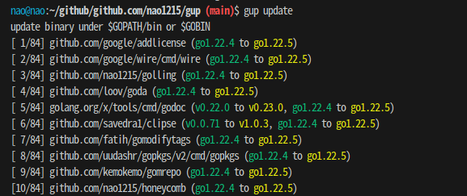
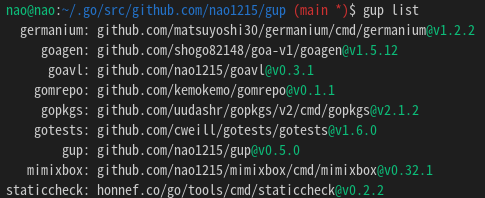

[](https://github.com/nao1215/gup/actions/workflows/build.yml)
[](https://github.com/nao1215/gup/actions/workflows/unit_test.yml)
[](https://github.com/nao1215/gup/actions/workflows/reviewdog.yml)
[](https://goreportcard.com/report/github.com/nao1215/gup)
  
[[日本語](./doc/ja/README.md)]  
# gup - Update binaries installed by "go install"
**gup** command update binaries installed by "go install" to the latest version. It also provides subcommands for manipulating binaries under \$GOPATH/bin (\$GOBIN).


gup command will notify you on your desktop whether the update was successful or unsuccessful after the update was finished.  


# How to install
### Step.1 Install golang
gup command only supports installation with `$ go install`. If you does not have the golang development environment installed on your system, please install golang from the [golang official website](https://go.dev/doc/install).

### Step2. Install gup
```
$ go install github.com/nao1215/gup@latest
```
# How to use
### Update all binaries
If you update all binaries, you just run `$ gup update`. 

```
$ gup update
gup:INFO : update all binary under $GOPATH/bin or $GOBIN
gup:INFO : [ 1/30] update success: github.com/cheat/cheat/cmd/cheat (Already up-to-date: v0.0.0-20211009161301-12ffa4cb5c87)
gup:INFO : [ 2/30] update success: fyne.io/fyne/v2/cmd/fyne_demo (Already up-to-date: v2.1.3)
gup:INFO : [ 3/30] update success: github.com/nao1215/gal/cmd/gal (v1.0.0 to v1.2.0)
gup:INFO : [ 4/30] update success: github.com/matsuyoshi30/germanium/cmd/germanium (Already up-to-date: v1.2.2)
gup:INFO : [ 5/30] update success: github.com/onsi/ginkgo/ginkgo (Already up-to-date: v1.16.5)
gup:INFO : [ 6/30] update success: github.com/git-chglog/git-chglog/cmd/git-chglog (Already up-to-date: v0.15.1)
   :
   :
```

### Update the specified binary
If you want to update only the specified binaries, you specify multiple command names separated by space.
```
$ gup update subaru gup ubume
gup:INFO : update all binary under $GOPATH/bin or $GOBIN
gup:INFO : [1/3] update success: github.com/nao1215/gup (v0.7.0 to v0.7.1)
gup:INFO : [2/3] update success: github.com/nao1215/subaru (Already up-to-date: v1.0.2)
gup:INFO : [3/3] update success: github.com/nao1215/ubume/cmd/ubume (Already up-to-date: v1.4.1)
```

### List up command name with package path and version under $GOPATH/bin
list subcommand print command information under $GOPATH/bin or $GOBIN. The output information is the command name, package path, and command version.


### Remove the specified binary
If you want to remove a command under $GOPATH/bin or $GOBIN, use the remove subcommand. The remove subcommand asks if you want to remove it before removing it.
```
$ gup remove subaru gal ubume
gup:CHECK: remove /home/nao/.go/bin/subaru? [Y/n] Y
gup:INFO : removed /home/nao/.go/bin/subaru
gup:CHECK: remove /home/nao/.go/bin/gal? [Y/n] n
gup:INFO : cancel removal /home/nao/.go/bin/gal
gup:CHECK: remove /home/nao/.go/bin/ubume? [Y/n] Y
gup:INFO : removed /home/nao/.go/bin/ubume
```

If you want to force the removal, use the --force option.
```
$ gup remove --force gal
gup:INFO : removed /home/nao/.go/bin/gal
```

### Check if the binary is the latest version
If you want to know if the binary is the latest version, use the check subcommand. check subcommand checks if the binary is the latest version and displays the name of the binary that needs to be updated.
```
$ gup check
gup:INFO : check all binary under $GOPATH/bin or $GOBIN
gup:INFO : [ 1/33] check success: github.com/cheat/cheat (Already up-to-date: v0.0.0-20211009161301-12ffa4cb5c87)
gup:INFO : [ 2/33] check success: fyne.io/fyne/v2 (v2.1.3 to v2.1.4)
   :
gup:INFO : [33/33] check success: github.com/nao1215/ubume (Already up-to-date: v1.5.0)

gup:INFO : If you want to update binaries, the following command.
           $ gup update fyne_demo gup mimixbox 
```
  
Like other subcommands, you can only check the specified binaries.
```
$ gup check lazygit mimixbox
gup:INFO : check all binary under $GOPATH/bin or $GOBIN
gup:INFO : [1/2] check success: github.com/jesseduffield/lazygit (Already up-to-date: v0.32.2)
gup:INFO : [2/2] check success: github.com/nao1215/mimixbox (v0.32.1 to v0.33.2)

gup:INFO : If you want to update binaries, the following command.
           $ gup update mimixbox 
```
### Export／Import subcommand
You use the export／import subcommand if you want to install the same golang binaries across multiple systems. By default, export-subcommand exports the file to $HOME/.config/gup/gup.conf. After you have placed gup.conf in the same path hierarchy on another system, you execute import-subcommand. gup start the installation 
according to the contents of gup.conf.

```
※ Environmet A (e.g. ubuntu)
$ gup export
gup:INFO: Export /home/nao/.config/gup/gup.conf

※ Environmet B (e.g. debian)
$ ls /home/nao/.config/gup/gup.conf
/home/nao/.config/gup/gup.conf
$ gup import
```

# Contributing
First off, thanks for taking the time to contribute! ❤️
See [CONTRIBUTING.md](./CONTRIBUTING.md) for more information.  

# Contact
If you would like to send comments such as "find a bug" or "request for additional features" to the developer, please use one of the following contacts.

- [GitHub Issue](https://github.com/nao1215/gup/issues)

# LICENSE
The gup project is licensed under the terms of [the Apache License 2.0](./LICENSE).
