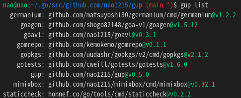

<!-- ALL-CONTRIBUTORS-BADGE:START - Do not remove or modify this section -->
[](#contributors-)
<!-- ALL-CONTRIBUTORS-BADGE:END -->
[](https://github.com/avelino/awesome-go)
[](https://github.com/nao1215/gup/actions/workflows/reviewdog.yml)

[](https://pkg.go.dev/github.com/nao1215/gup)
[](https://goreportcard.com/report/github.com/nao1215/gup)


[English](../../README.md) | [日本語](../ja/README.md) | [Русский](../ru/README.md) | [中文](../zh-cn/README.md) | [한국어](../ko/README.md) | [Español](../es/README.md) | [Français](../fr/README.md)

<!-- gup:translation-sync -->
> 📖 이 문서는 번역본이며, 최신 정보는 정본인 [영문 README](../../README.md)를 참고하세요 (번역이 영문판보다 늦을 수 있습니다).

# gup - "go install"로 설치된 바이너리 업데이트


gup은 `$GOBIN`에 있는 전역 Go 명령줄 도구를 업데이트하고 관리합니다. `go install`은 각 프로그램을 `$GOBIN`(`$GOPATH/bin`)에 설치하지만 그 이후로는 다시 업데이트하지 않고, 무엇을 설치했는지에 대한 매니페스트도 남기지 않으며, 의존하는 도구를 특정 버전에 고정해 둘 방법도 제공하지 않습니다. gup은 그 도구 세트를 관리합니다. 전체 세트를 병렬로 한꺼번에 최신 상태로 만들고, 선택한 도구를 정확한 버전에 `pin`할 수 있으며, `go install`에 없는 관리 명령어를 추가합니다. 설치된 도구를 나열/확인(`list`/`check`)하고, 바이너리를 제거(`remove`)하고, 다른 머신에서 재현할 수 있도록 도구 세트를 내보내고/가져오며(`export`/`import`), 새 `$GOBIN`으로 이전(`migrate`)할 수 있습니다. Windows, macOS, Linux에서 실행됩니다.

## 지원되는 OS (GitHub Actions를 통한 단위 테스트)
- Linux
- Mac
- Windows

## 설치 방법
gup은 `go install`과 Homebrew 외에도 `winget`, `mise`, `nix`로 바로 설치할 수 있습니다.

### "go install" 사용
시스템에 golang 개발 환경이 설치되어 있지 않은 경우, [golang 공식 웹사이트](https://go.dev/doc/install)에서 golang을 설치하세요.
```
go install github.com/nao1215/gup@latest
```
소스에서 빌드하려면 Go 1.25 이상이 필요합니다. 더 오래된 Go에서는 미리 빌드된 릴리스 바이너리나 패키지를 설치하세요(아래 참고).

### homebrew 사용
```shell
brew install nao1215/tap/gup
```

### winget 사용 (Windows)
```shell
winget install --id nao1215.gup
```

### mise-en-place 사용
```shell
mise use -g gup@latest
```

### nix 사용 (Nix profile)
```shell
nix profile install nixpkgs#gogup
```

### 패키지 또는 바이너리에서 설치
[릴리스 페이지](https://github.com/nao1215/gup/releases)에는 .deb, .rpm, .apk 형식의 패키지가 포함되어 있습니다. gup 명령어는 내부적으로 go 명령어를 사용하므로 golang 설치가 필요합니다.

## 릴리스 무결성 검증
모든 릴리스에는 다운로드한 항목을 검증할 수 있도록 공급망 메타데이터가 함께 제공됩니다.

- 서명된 체크섬: `checksums.txt`는 [cosign](https://github.com/sigstore/cosign)(키리스)으로 서명되어 `checksums.txt.sigstore.json`을 생성합니다.
- SBOM: 각 릴리스 아카이브에 SPDX 소프트웨어 자재 명세서(Software Bill of Materials)가 첨부됩니다.
- 빌드 출처: SLSA 빌드 출처(provenance)는 GitHub OIDC를 통해 증명됩니다.

서명된 체크섬을 검증하세요(그런 다음 아카이브를 `checksums.txt`와 대조하세요).

```shell
cosign verify-blob \
  --bundle checksums.txt.sigstore.json \
  --certificate-identity-regexp 'https://github.com/nao1215/gup/\.github/workflows/release\.yml@refs/tags/.*' \
  --certificate-oidc-issuer 'https://token.actions.githubusercontent.com' \
  checksums.txt
sha256sum --check --ignore-missing checksums.txt
```

GitHub CLI로 다운로드한 아티팩트의 빌드 출처를 검증하세요.

```shell
gh attestation verify gup_<version>_<os>_<arch>.tar.gz --repo nao1215/gup
```

## 사용 방법
### 모든 바이너리 업데이트
모든 바이너리를 업데이트하려면 `$ gup update`를 실행하면 됩니다.

```shell
$ gup update
update binary under $GOPATH/bin or $GOBIN
[ 1/30] github.com/cheat/cheat/cmd/cheat (Already up-to-date: v0.0.0-20211009161301-12ffa4cb5c87 / go1.22.4)
[ 2/30] fyne.io/fyne/v2/cmd/fyne_demo (Already up-to-date: v2.1.3 / go1.22.4)
[ 3/30] github.com/nao1215/gal/cmd/gal (v1.0.0 to v1.2.0 / go1.22.4)
[ 4/30] github.com/matsuyoshi30/germanium/cmd/germanium (Already up-to-date: v1.2.2 / go1.22.4)
[ 5/30] github.com/onsi/ginkgo/ginkgo (Already up-to-date: v1.16.5 / go1.22.4)
[ 6/30] github.com/git-chglog/git-chglog/cmd/git-chglog (Already up-to-date: v0.15.1 / go1.22.4)
  :
  :
```

### 지정된 바이너리 업데이트
특정 바이너리만 업데이트하려면 공백으로 구분된 여러 명령어 이름을 지정합니다.
```shell
$ gup update subaru gup ubume
update binary under $GOPATH/bin or $GOBIN
[1/3] github.com/nao1215/gup (v0.7.0 to v0.7.1, go1.20.1 to go1.22.4)
[2/3] github.com/nao1215/subaru (Already up-to-date: v1.0.2 / go1.22.4)
[3/3] github.com/nao1215/ubume/cmd/ubume (Already up-to-date: v1.4.1 / go1.22.4)
```

### gup update 중 바이너리 제외
일부 바이너리를 업데이트하지 않으려면 업데이트하지 않을 바이너리를 공백 없이 ','로 구분하여 지정하면 됩니다.
--dry-run과 함께 사용할 수도 있습니다.
```shell
$ gup update --exclude=gopls,golangci-lint    //--exclude 또는 -e, 이 예제는 'gopls'와 'golangci-lint'를 제외합니다
```

### @main, @master, @latest로 바이너리 업데이트
바이너리별로 업데이트 소스를 제어하려면 다음 옵션을 사용하세요.
- `--main` (`-m`): `@main`으로 업데이트 (실패 시 `@master`로 폴백)
- `--master`: `@master`로 업데이트
- `--latest`: `@latest`로 업데이트

선택한 채널은 `gup.json`에 저장되며 이후 `gup update` 실행 시 재사용됩니다.
```shell
$ gup update --main=gup,lazygit --master=sqly --latest=air
```

### 도구를 특정 버전에 고정

전역 도구가 특정 버전을 유지해야 할 때, 예를 들어 CI나 팀 전체 개발 환경과 일치시켜야 할 때 `pin`을 사용하세요.

```shell
$ gup pin golangci-lint v1.62.0
$ gup update
```

고정된 도구는 `@latest`가 아니라 기록된 버전(`go install <import_path>@<version>`)으로 설치됩니다. `gup update`는 해당 도구를 그 버전에 유지하며, 설치된 버전이 다르면 그 버전으로 다시 설치합니다. 나머지 도구 세트는 평소처럼 업데이트됩니다. pin은 Go 빌드가 아니라 모듈 버전을 잠그므로, Go 툴체인이 바뀌면 고정된 도구도 여전히 고정된 버전으로 다시 빌드됩니다(고정되지 않은 도구와 정확히 동일하게, `--ignore-go-update`로 이를 억제할 수 있습니다). pin은 `gup.json`에 `channel: "pinned"`로 저장됩니다.

```json
{
  "schema_version": 2,
  "packages": [
    {
      "name": "golangci-lint",
      "import_path": "github.com/golangci/golangci-lint/cmd/golangci-lint",
      "version": "v1.62.0",
      "channel": "pinned"
    }
  ]
}
```

`gup pin`은 `tool@version` 형식(`gup pin golangci-lint@v1.62.0`)도 받아들입니다. 도구는 이미 `$GOBIN` 아래에 설치되어 있어야 합니다. 도구를 다시 업데이트할 수 있도록 허용하려면 다음과 같이 합니다.

```shell
$ gup unpin golangci-lint
```

`gup check`는 고정된 도구가 고정된 버전에 있고 현재 Go 툴체인으로 빌드되어 있으면 `pinned`로 보고하며, 설치된 버전이 다르거나 Go 툴체인 재빌드가 보류 중이면 `pin-mismatch`로 보고합니다(`gup update <name>` 제안과 함께). 고정된 도구를 `@latest`와 비교하는 일은 절대 없습니다.

### $GOPATH/bin 아래의 명령어 이름을 패키지 경로 및 버전과 함께 나열
list 하위 명령어는 $GOPATH/bin 또는 $GOBIN 아래의 명령어 정보를 출력합니다. 출력 정보는 명령어 이름, 패키지 경로, 명령어 버전입니다.


### 지정된 바이너리 제거
$GOPATH/bin 또는 $GOBIN 아래의 명령어를 제거하려면 remove 하위 명령어를 사용합니다. remove 하위 명령어는 제거하기 전에 제거할 것인지 묻습니다.
```shell
$ gup remove subaru gal ubume
gup:CHECK: remove /home/nao/.go/bin/subaru? [Y/n] Y
removed /home/nao/.go/bin/subaru
gup:CHECK: remove /home/nao/.go/bin/gal? [Y/n] n
cancel removal /home/nao/.go/bin/gal
gup:CHECK: remove /home/nao/.go/bin/ubume? [Y/n] Y
removed /home/nao/.go/bin/ubume
```

강제로 제거하려면 --force 옵션을 사용합니다.
```shell
$ gup remove --force gal
removed /home/nao/.go/bin/gal
```

### 바이너리가 최신 버전인지 확인
바이너리가 최신 버전인지 알고 싶다면 check 하위 명령어를 사용합니다. check 하위 명령어는 바이너리가 최신 버전인지 확인하고 업데이트가 필요한 바이너리의 이름을 표시합니다.
```shell
$ gup check
check binary under $GOPATH/bin or $GOBIN
[ 1/33] github.com/cheat/cheat (Already up-to-date: v0.0.0-20211009161301-12ffa4cb5c87 / go1.22.4)
[ 2/33] fyne.io/fyne/v2 (current: v2.1.3, latest: v2.1.4 / current: go1.20.2, installed: go1.22.4)
  :
[33/33] github.com/nao1215/ubume (Already up-to-date: v1.5.0 / go1.22.4)

If you want to update binaries, the following command.
          $ gup update fyne_demo gup mimixbox
```

다른 하위 명령어와 마찬가지로 지정된 바이너리만 확인할 수 있습니다.
```shell
$ gup check lazygit mimixbox
check binary under $GOPATH/bin or $GOBIN
[1/2] github.com/jesseduffield/lazygit (Already up-to-date: v0.32.2 / go1.22.4)
[2/2] github.com/nao1215/mimixbox (current: v0.32.1, latest: v0.33.2 / go1.22.4)

If you want to update binaries, the following command.
          $ gup update mimixbox
```

### 많은 도구 세트를 위한 조용한 출력
`check`와 `update`는 기본적으로 모든 바이너리를 출력하는데, 설치된 도구가 많으면 출력이 지나치게 많아집니다. `--quiet` (`-q`)를 전달하면 최신 상태 줄을 숨기고, 업데이트된(또는 업데이트가 가능한) 바이너리와 실패만 표시한 뒤 한 줄 요약을 보여줍니다. 오류는 항상 STDERR에 기록되므로 계속 보입니다. `--json`도 함께 지정하면 `--quiet`는 무시되고 전체 JSON 배열이 출력됩니다.
```shell
$ gup update --quiet
github.com/nao1215/gup (v0.7.0 to v0.7.1)
gup: 1 updated, 8 up-to-date, 0 failed

$ gup check -q
github.com/nao1215/gup (current: v0.7.0, latest: v0.7.1 / go1.22.4)

If you want to update binaries, run the following command.
           $ gup update gup
gup: 1 update available, 8 up-to-date, 0 failed
```

### 기계 판독 가능한 JSON 출력 (스크립팅 / CI용)
`list`, `check`, `update`는 `--json`을 받아들이며, 사람이 읽기 좋은 출력(기본값으로 유지됨) 대신 JSON 배열을 출력합니다.

```shell
$ gup check --json
[
  {
    "name": "gup",
    "import_path": "github.com/nao1215/gup",
    "module_path": "github.com/nao1215/gup",
    "channel": "latest",
    "current_version": "v1.0.0",
    "latest_version": "v1.1.0",
    "current_go_version": "go1.22.4",
    "installed_go_version": "go1.22.4",
    "status": "update-available"
  }
]
```

각 요소에는 다음 필드가 있습니다: `name`, `import_path`, `module_path`, `channel` (`latest`/`main`/`master`/`pinned`), `current_version`, `latest_version` (`list`와 고정된 패키지의 경우 비어 있음), `pinned_version` (`channel: "pinned"`인 경우에만 존재), `current_go_version`, `installed_go_version`, `status`, `error` (없을 때는 생략됨), 그리고 `hint` (다음 단계 제안이며, 오류에 적용되는 경우에만 존재). `status`는 `installed` (list), `up-to-date`, `update-available` (check), `updated` (update), `pinned`/`pin-mismatch` (고정된 버전에 있거나/벗어난 고정된 패키지), 또는 `error` 중 하나입니다.

배열은 부분 실패가 있더라도 항상 유효한 JSON입니다(해당 패키지는 `"status": "error"`를 가지며, 오류 세부 정보는 STDERR로도 출력되므로 STDOUT은 순수한 JSON으로 유지됩니다). 종료 코드는 변경되지 않습니다—`check`가 `update-available`을 보고하더라도 여전히 `0`으로 종료됩니다.

### 빈 환경에서의 동작
빈 전역 환경(아직 `go install`로 설치한 바이너리가 하나도 없는 상태)은 오류가 아니라 정상적인 첫 실행 상황으로 처리됩니다.

- `list`, `check`, `update`는 `0`으로 종료하며 짧은 안내 메시지를 출력합니다(`--json` 사용 시 유효한 빈 배열 `[]`).
- `export`는 `0`으로 종료하고 빈 `gup.json`을 기록합니다.

설치되지 않은 바이너리 이름을 지정하거나 모든 바이너리를 제외하면 여전히 사용 오류이며 `1`로 종료합니다.

### Export／Import 하위 명령어
여러 시스템에서 동일한 golang 바이너리를 설치하려면 export／import 하위 명령어를 사용합니다.
`gup.json`은 각 도구의 import path, 기록된 바이너리 `version`, 그리고 업데이트 `channel`(`latest` / `main` / `master` / `pinned`)을 저장합니다. `channel: "pinned"`의 경우 `version`은 도구가 고정된 정확한 대상 버전이며, 다른 채널의 경우 내보내기 시점에 기록된 버전입니다. `import`는 파일에 기록된 정확한 버전을 설치하고, 고정된 패키지는 가져온 후에도 고정된 상태로 유지됩니다.

```json
{
  "schema_version": 1,
  "packages": [
    {
      "name": "gal",
      "import_path": "github.com/nao1215/gal/cmd/gal",
      "version": "v1.1.1",
      "channel": "latest"
    },
    {
      "name": "posixer",
      "import_path": "github.com/nao1215/posixer",
      "version": "v0.1.0",
      "channel": "main"
    }
  ]
}
```

기본 동작:
- `gup export`는 `$XDG_CONFIG_HOME/gup/gup.json`에 기록합니다.
- `gup import`, `gup check`, `gup update`는 다음 순서로 설정 파일을 자동 탐지합니다.
  1) `$XDG_CONFIG_HOME/gup/gup.json` (존재하는 경우)
  2) `./gup.json` (존재하는 경우)

사용자 레벨 `gup.json`과 `./gup.json`이 모두 존재하면 `import`, `check`, `update`, `list --json`은 둘 중 하나를 조용히 선택하지 않고 즉시 실패하며 `--file`로 명확히 지정하도록 요구합니다. `--file` (`-f`)로 경로를 덮어쓸 수 있습니다. `list`는 보고되는 `channel`을 제공하는 설정을 선택하기 위해 `--json`과 함께 `--file`을 받아들입니다.

`schema_version`은 고정된 패키지가 없는 설정에서는 `1`이고, 어떤 패키지든 고정되면 `2`가 됩니다. 따라서 pin을 전혀 사용하지 않는 환경은 이전 gup 릴리스가 읽을 수 있는 `1` 형식을 계속 생성합니다. gup은 `1`과 `2`를 모두 읽습니다. `pinned` 채널은 `schema_version: 2`에서만 유효합니다. `schema_version: 1` 아래의 `pinned` 항목, 구체적인 버전이 없는 고정된 패키지, 알 수 없는 채널 값, 지원되지 않는 `schema_version`은 거부됩니다.

형식이 잘못되었거나 유효하지 않은 `gup.json`(잘못된 JSON, 알 수 없는 채널, 지원되지 않는 `schema_version`, 안전하지 않은 pin)은 조용히 무시되지 않고 오류로 처리됩니다. `check`, `update`, `export`는 즉시 실패하며 문제가 된 파일 이름을 알려주므로, 설정을 파싱할 수 없다는 이유로 저장된 패키지별 채널이 조용히 `latest`로 강등되는 일은 없습니다. 알 수 없는 채널은 절대 `latest`로 정규화되지 않습니다.

`gup export`는 저장된 업데이트 채널을 항상 정규 사용자 레벨 `gup.json`에서 해석합니다. `--file`/`--output`은 내보내기 대상만 바꾸므로, 새 파일로 내보내도 패키지의 채널이 `latest`로 초기화되지 않습니다.

```shell
※ 환경 A (예: ubuntu)
$ gup export
Export /home/nao/.config/gup/gup.json

※ 환경 B (예: debian)
$ gup import
```

또는 export 하위 명령어는 `--output` 옵션으로 `gup.json`과 동일한 내용을 STDOUT에 출력할 수 있습니다. import 하위 명령어는 `--file` 옵션으로 읽을 파일 경로를 지정할 수 있습니다.
```shell
※ 환경 A (예: ubuntu)
$ gup export --output > gup.json

※ 환경 B (예: debian)
$ gup import --file=gup.json
```

### 바이너리를 새 $GOBIN으로 마이그레이션

```shell
gup migrate BEFORE_PATH AFTER_PATH [BINARY...]
```

`gup migrate`는 각 바이너리의 빌드 정보에 기록된 정확한 `import path@version`을 사용하여 `BEFORE_PATH` 아래의 Go 바이너리를 `AFTER_PATH`로 다시 설치합니다(절대로 조용히 `@latest`로 업그레이드하지 않습니다). 내부적으로는 단순히 `GOBIN`을 `AFTER_PATH`로 설정하고 일반적인 `go install` 경로를 실행하므로, 바이너리는 현재 사용 중인 Go 툴체인으로 다시 빌드됩니다.

#### 이것이 유용한 이유 (예: `mise`와 함께)

[`mise`](https://mise.jdx.dev/)로 Go를 관리할 때, Go를 업데이트하면 Go 버전마다 `$GOBIN`의 실제 경로가 바뀔 수 있습니다. 그 결과 이전 `$GOBIN` 아래에 설치한 도구들이 새 Go에서는 더 이상 보이지 않게 됩니다. `gup migrate`를 사용하면 이전 `$GOBIN`의 동일한 Go 도구 세트를 새 `$GOBIN`으로 다시 설치할 수 있습니다.

```shell
# 이전 GOBIN의 모든 go-install 도구를 새 GOBIN으로 다시 설치
$ gup migrate ~/.local/share/mise/installs/go/1.24.0/bin ~/.local/share/mise/installs/go/1.25.0/bin

# 특정 바이너리만 마이그레이션
$ gup migrate /old/gobin /new/gobin gopls air
```

`migrate`는 추가 전용(add-only)입니다.

- `AFTER_PATH`의 파일을 삭제하거나 정리하지 않습니다.
- `AFTER_PATH`에 이미 존재하는 바이너리는 기본적으로 건너뜁니다. 덮어쓰며 다시 설치하려면 `--force`를 사용하세요.
- `AFTER_PATH`가 존재하지 않으면 자동으로 생성됩니다.
- `BEFORE_PATH`와 `AFTER_PATH`는 서로 다른 디렉터리여야 합니다.

import path 또는 버전을 확인할 수 없는 바이너리와 개발 빌드(`devel` / `(devel)`)는 업그레이드되지 않고 건너뛰므로, 로컬 또는 재현 불가능한 빌드는 절대 깨지지 않습니다.

지원되는 플래그: `--dry-run` (`-n`), `--notify` (`-N`), `--jobs` (`-j`), `--force`.

### man 페이지 생성 (linux, mac용)
man 하위 명령어는 기본적으로 `/usr/share/man/man1` 아래에 man 페이지를 생성합니다. `MANPATH`가 설정되어 있으면 각 항목 아래의 `man1` 디렉터리에 기록하며, 아직 없으면 생성합니다. 쓸 수 없는 대상이면 명확한 오류와 함께 종료합니다.
```shell
$ sudo gup man
Generate /usr/share/man/man1/gup-bug-report.1.gz
Generate /usr/share/man/man1/gup-check.1.gz
Generate /usr/share/man/man1/gup-completion.1.gz
Generate /usr/share/man/man1/gup-export.1.gz
Generate /usr/share/man/man1/gup-import.1.gz
Generate /usr/share/man/man1/gup-list.1.gz
Generate /usr/share/man/man1/gup-man.1.gz
Generate /usr/share/man/man1/gup-migrate.1.gz
Generate /usr/share/man/man1/gup-remove.1.gz
Generate /usr/share/man/man1/gup-update.1.gz
Generate /usr/share/man/man1/gup-version.1.gz
Generate /usr/share/man/man1/gup.1.gz
```

### 셸 완성 파일 생성 (bash, zsh, fish, PowerShell용)
`completion` 하위 명령어는 셸 이름을 인수로 전달하면 완성 스크립트를 표준 출력으로 출력합니다.
bash/fish/zsh 완성 파일을 사용자 환경에 설치하려면 `--install`을 사용하세요.
PowerShell은 출력을 `.ps1` 파일로 리디렉션한 뒤 프로필에서 불러오세요.

```shell
$ gup completion bash > gup.bash
$ gup completion zsh > _gup
$ gup completion fish > gup.fish
$ gup completion powershell > gup.ps1

# 기본 사용자 경로에 완성 파일 자동 설치
$ gup completion --install
```

`--install`은 `HOME`이 설정되어 있어야 합니다. `HOME`이 비어 있으면 (현재 디렉터리에 파일을 쓰지 않고) 즉시 실패하며, 보완 파일 중 하나라도 쓸 수 없으면 0이 아닌 코드로 종료합니다.

### 데스크톱 알림
--notify 옵션과 함께 gup을 사용하면 업데이트 완료 후 업데이트가 성공했는지 실패했는지 데스크톱에서 알려줍니다.
```shell
$ gup update --notify
```


### 컬러 출력 비활성화
gup은 기본적으로 출력에 색상을 입힙니다. 색상을 끄려면 `--no-color`를 전달하거나 `NO_COLOR` 환경 변수를 비어 있지 않은 값으로 설정하세요([NO_COLOR](https://no-color.org/) 규약을 따릅니다). 이는 출력을 파이프로 전달할 때, CI 로그에서, 또는 `NO_COLOR`를 전역으로 설정한 경우에 유용합니다.
```shell
$ gup update --no-color
$ NO_COLOR=1 gup update
```


## gup vs. `go tool`
Go 1.24에 내장된 [`go tool`](https://go.dev/doc/modules/managing-dependencies#tools)은 단일 프로젝트로 범위가 제한되고 해당 프로젝트의 `go.mod`에 기록된 도구를 관리하므로, 그 도구들은 해당 모듈 안에서만 존재합니다. gup은 `$GOBIN` 아래에 시스템 전역으로 설치되어 어느 디렉터리에서나 실행하고 dotfiles와 함께 보관하는 명령어인 바이너리를 관리하며, 의존하는 버전에 선택적으로 고정할 수 있습니다. 프로젝트별 도구에는 `go tool`을, 전역 도구 모음에는 gup을 사용하세요.

## 기능 비교

| 기능 | gup | [go-global-update](https://github.com/Gelio/go-global-update) | `go install` loop |
| --- | :-: | :-: | :-: |
| 병렬 업데이트 | 예 | 아니오 | 수동 |
| 업데이트 시간(바이너리 9개) | 0.7s | 2.9s | 2.9s |
| 패키지별 업데이트 채널 (`latest`/`main`/`master`) | 예 | 아니오 | 수동 |
| 버전 고정 / 잠금 | 예 | 아니오 | 수동 |
| 도구 세트 내보내기/가져오기 | 예 | 아니오 | 수동 |
| 새 `$GOBIN`으로 바이너리 마이그레이션 | 예 | 아니오 | 수동 |
| 기계 판독 가능한 JSON 출력 (`--json`) | 예 | 아니오 | 아니오 |
| 셸 완성 생성/설치 | 예 | 아니오 | 아니오 |
| `update`가 최신 상태의 바이너리를 다시 설치 | 아니오 | 예 | 예 |
| 대상이 이미 존재할 때 `migrate --force`로 다시 설치 | 예 | 아니오 | 수동 |
| 실패 진단 / 다음 단계 힌트 | 예 | 예 | 아니오 |
| `NO_COLOR` 지원 | 예 | 예 | — |

*업데이트 시간: 각각 새 버전이 제공되는 9개의 바이너리 업데이트. gup은 병렬, 나머지는 순차. AMD Ryzen AI Max+ 395 / go 1.26.4, 워밍업된 캐시로 5회 실행한 중앙값. 시간은 빌드 시간과 CPU에 따라 달라집니다.*

## FAQ

### `gup`이 `fatal: not a git repository`로 실패합니다
oh-my-zsh를 사용 중일 가능성이 높습니다. oh-my-zsh는 `git pull --rebase`에 대한 `gup` 별칭을 제공하는데, 이 별칭이 이 명령어를 가립니다([#16](https://github.com/nao1215/gup/issues/16), [#204](https://github.com/nao1215/gup/issues/204)). 해당 별칭을 제거하거나 이름을 바꾸세요. 또는 앞에 백슬래시를 붙여 별칭을 우회하여 gup을 실행하세요.
```shell
$ \gup update
```

## 기여하기
먼저 기여할 시간을 내주셔서 감사합니다! ❤️ 자세한 내용은 [CONTRIBUTING.md](../../CONTRIBUTING.md)를 참조하세요.
개발 워크플로, 품질 체크리스트, 도구 관리 방법은 [CONTRIBUTING.md](../../CONTRIBUTING.md)에 문서화되어 있습니다.
기여는 개발과 관련된 것만이 아닙니다. 예를 들어 GitHub Star는 제가 개발하는 데 동기를 부여합니다!

### Star 히스토리
[](https://star-history.com/#nao1215/gup&Date)

## 연락처
"버그를 발견했습니다" 또는 "추가 기능 요청"과 같은 의견을 개발자에게 보내려면 다음 연락처 중 하나를 사용하십시오.

- [GitHub Issue](https://github.com/nao1215/gup/issues)

bug-report 하위 명령어를 사용하여 버그 리포트를 보낼 수 있습니다.
```
$ gup bug-report
※ 기본 브라우저로 GitHub 이슈 페이지 열기
```

## 라이센스
gup 프로젝트는 [Apache License 2.0](../../LICENSE)의 조건에 따라 라이센스가 부여됩니다.


## 기여자 ✨

이 멋진 사람들에게 감사드립니다 ([이모지 키](https://allcontributors.org/docs/en/emoji-key)):

<!-- ALL-CONTRIBUTORS-LIST:START - Do not remove or modify this section -->
<!-- prettier-ignore-start -->
<!-- markdownlint-disable -->
<table>
  <tbody>
    <tr>
      <td align="center" valign="top" width="14.28%"><a href="https://debimate.jp/"><br /><sub><b>CHIKAMATSU Naohiro</b></sub></a><br /><a href="https://github.com/nao1215/gup/commits?author=nao1215" title="Code">💻</a></td>
      <td align="center" valign="top" width="14.28%"><a href="https://qiita.com/KEINOS"><br /><sub><b>KEINOS</b></sub></a><br /><a href="https://github.com/nao1215/gup/commits?author=KEINOS" title="Code">💻</a></td>
      <td align="center" valign="top" width="14.28%"><a href="https://mattn.kaoriya.net/"><br /><sub><b>mattn</b></sub></a><br /><a href="https://github.com/nao1215/gup/commits?author=mattn" title="Code">💻</a></td>
      <td align="center" valign="top" width="14.28%"><a href="https://jlec.de/"><br /><sub><b>Justin Lecher</b></sub></a><br /><a href="https://github.com/nao1215/gup/commits?author=jlec" title="Code">💻</a></td>
      <td align="center" valign="top" width="14.28%"><a href="https://github.com/lincolnthalles"><br /><sub><b>Lincoln Nogueira</b></sub></a><br /><a href="https://github.com/nao1215/gup/commits?author=lincolnthalles" title="Code">💻</a></td>
      <td align="center" valign="top" width="14.28%"><a href="https://github.com/matsuyoshi30"><br /><sub><b>Masaya Watanabe</b></sub></a><br /><a href="https://github.com/nao1215/gup/commits?author=matsuyoshi30" title="Code">💻</a></td>
      <td align="center" valign="top" width="14.28%"><a href="https://github.com/memreflect"><br /><sub><b>memreflect</b></sub></a><br /><a href="https://github.com/nao1215/gup/commits?author=memreflect" title="Code">💻</a></td>
    </tr>
    <tr>
      <td align="center" valign="top" width="14.28%"><a href="https://github.com/Akimon658"><br /><sub><b>Akimo</b></sub></a><br /><a href="https://github.com/nao1215/gup/commits?author=Akimon658" title="Code">💻</a></td>
      <td align="center" valign="top" width="14.28%"><a href="https://github.com/rkscv"><br /><sub><b>rkscv</b></sub></a><br /><a href="https://github.com/nao1215/gup/commits?author=rkscv" title="Code">💻</a></td>
      <td align="center" valign="top" width="14.28%"><a href="https://github.com/scop"><br /><sub><b>Ville Skyttä</b></sub></a><br /><a href="https://github.com/nao1215/gup/commits?author=scop" title="Code">💻</a></td>
      <td align="center" valign="top" width="14.28%"><a href="https://mochaa.ws/?utm_source=github_user"><br /><sub><b>Zephyr Lykos</b></sub></a><br /><a href="https://github.com/nao1215/gup/commits?author=mochaaP" title="Code">💻</a></td>
      <td align="center" valign="top" width="14.28%"><a href="https://itrooz.fr"><br /><sub><b>iTrooz</b></sub></a><br /><a href="https://github.com/nao1215/gup/commits?author=iTrooz" title="Code">💻</a></td>
      <td align="center" valign="top" width="14.28%"><a href="http://pacman.blog.br"><br /><sub><b>Tiago Peczenyj</b></sub></a><br /><a href="https://github.com/nao1215/gup/commits?author=peczenyj" title="Code">💻</a></td>
    </tr>
  </tbody>
</table>

<!-- markdownlint-restore -->
<!-- prettier-ignore-end -->

<!-- ALL-CONTRIBUTORS-LIST:END -->

이 프로젝트는 [all-contributors](https://github.com/all-contributors/all-contributors) 사양을 따릅니다. 모든 종류의 기여를 환영합니다!
