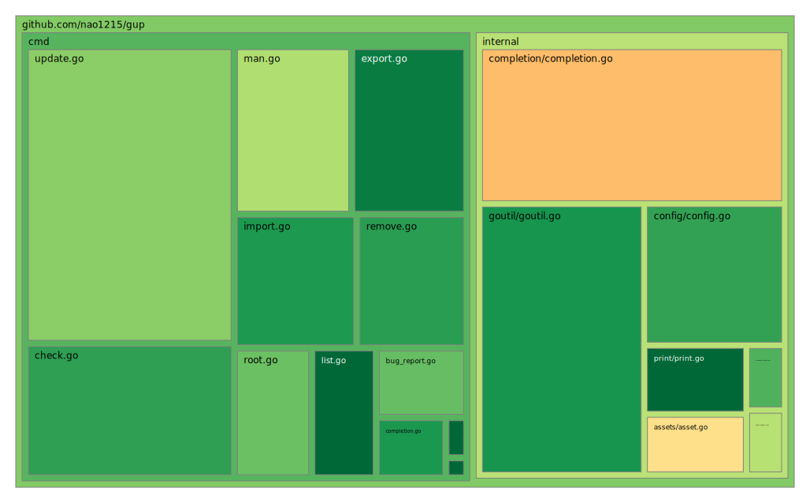

<!-- ALL-CONTRIBUTORS-BADGE:START - Do not remove or modify this section -->
[](#contributors-)
<!-- ALL-CONTRIBUTORS-BADGE:END -->
[](https://github.com/avelino/awesome-go)
[](https://github.com/nao1215/gup/actions/workflows/reviewdog.yml)

[](https://github.com/nao1215/gup/actions/workflows/security.yml)
[](https://pkg.go.dev/github.com/nao1215/gup)
[](https://goreportcard.com/report/github.com/nao1215/gup)


[日本語](../ja/README.md) | [Русский](./README.md) | [中文](../zh-cn/README.md) | [한국어](../ko/README.md) | [Español](../es/README.md) | [Français](../fr/README.md)

# gup - Обновляет бинарные файлы, установленные через "go install"


Команда **gup** обновляет бинарные файлы, установленные через "go install", до последней версии. gup обновляет все бинарные файлы параллельно, поэтому работает очень быстро. Она также предоставляет подкоманды для управления бинарными файлами в \$GOPATH/bin (\$GOBIN). Это кроссплатформенное программное обеспечение, которое работает на Windows, Mac и Linux.

Если вы используете oh-my-zsh, то для gup установлен алиас. Этот алиас - `gup - git pull --rebase`. Поэтому убедитесь, что алиас oh-my-zsh отключен (например, $ \gup update).


## Поддерживаемые ОС (модульное тестирование с GitHub Actions)
- Linux
- Mac
- Windows

## Как установить
### Использовать "go install"
Если на вашей системе не установлена среда разработки golang, пожалуйста, установите golang с [официального сайта golang](https://go.dev/doc/install).
```
go install github.com/nao1215/gup@latest
```

### Использовать homebrew
```shell
brew install nao1215/tap/gup
```

### Установка из пакета или бинарного файла
[Страница релизов](https://github.com/nao1215/gup/releases) содержит пакеты в форматах .deb, .rpm и .apk. Команда gup использует команду go внутренне, поэтому требуется установка golang.


## Как использовать
### Обновить все бинарные файлы
Если вы хотите обновить все бинарные файлы, просто выполните `$ gup update`.

```shell
$ gup update
update binary under $GOPATH/bin or $GOBIN
[ 1/30] github.com/cheat/cheat/cmd/cheat (Already up-to-date: v0.0.0-20211009161301-12ffa4cb5c87 / go1.22.4)
[ 2/30] fyne.io/fyne/v2/cmd/fyne_demo (Already up-to-date: v2.1.3 / go1.22.4)
[ 3/30] github.com/nao1215/gal/cmd/gal (v1.0.0 to v1.2.0 / go1.22.4)
[ 4/30] github.com/matsuyoshi30/germanium/cmd/germanium (Already up-to-date: v1.2.2 / go1.22.4)
[ 5/30] github.com/onsi/ginkgo/ginkgo (Already up-to-date: v1.16.5 / go1.22.4)
[ 6/30] github.com/git-chglog/git-chglog/cmd/git-chglog (Already up-to-date: v0.15.1 / go1.22.4)
   :
   :
```

### Обновить указанный бинарный файл
Если вы хотите обновить только указанные бинарные файлы, укажите несколько имён команд, разделённых пробелом.
```shell
$ gup update subaru gup ubume
update binary under $GOPATH/bin or $GOBIN
[1/3] github.com/nao1215/gup (v0.7.0 to v0.7.1, go1.20.1 to go1.22.4)
[2/3] github.com/nao1215/subaru (Already up-to-date: v1.0.2 / go1.22.4)
[3/3] github.com/nao1215/ubume/cmd/ubume (Already up-to-date: v1.4.1 / go1.22.4)
```

### Исключить бинарные файлы во время gup update
Если вы не хотите обновлять некоторые бинарные файлы, просто укажите бинарные файлы, которые не должны быть обновлены, разделённые ',' без пробелов в качестве разделителя.
Также работает в сочетании с --dry-run
```shell
$ gup update --exclude=gopls,golangci-lint    //--exclude или -e, этот пример исключит 'gopls' и 'golangci-lint'
```

### Обновить бинарные файлы с @main или @master
Если вы хотите обновить бинарные файлы с @master или @main, вы можете указать опцию -m или --master.
```shell
$ gup update --main=gup,lazygit,sqly
```

### Вывести список имён команд с путём пакета и версией в $GOPATH/bin
Подкоманда list выводит информацию о командах в $GOPATH/bin или $GOBIN. Выводимая информация - это имя команды, путь пакета и версия команды.


### Удалить указанный бинарный файл
Если вы хотите удалить команду в $GOPATH/bin или $GOBIN, используйте подкоманду remove. Подкоманда remove спрашивает, хотите ли вы её удалить, перед удалением.
```shell
$ gup remove subaru gal ubume
gup:CHECK: remove /home/nao/.go/bin/subaru? [Y/n] Y
removed /home/nao/.go/bin/subaru
gup:CHECK: remove /home/nao/.go/bin/gal? [Y/n] n
cancel removal /home/nao/.go/bin/gal
gup:CHECK: remove /home/nao/.go/bin/ubume? [Y/n] Y
removed /home/nao/.go/bin/ubume
```

Если вы хотите принудительное удаление, используйте опцию --force.
```shell
$ gup remove --force gal
removed /home/nao/.go/bin/gal
```

### Проверить, является ли бинарный файл последней версией
Если вы хотите знать, является ли бинарный файл последней версией, используйте подкоманду check. Подкоманда check проверяет, является ли бинарный файл последней версией, и отображает имя бинарного файла, который нуждается в обновлении.
```shell
$ gup check
check binary under $GOPATH/bin or $GOBIN
[ 1/33] github.com/cheat/cheat (Already up-to-date: v0.0.0-20211009161301-12ffa4cb5c87 / go1.22.4)
[ 2/33] fyne.io/fyne/v2 (current: v2.1.3, latest: v2.1.4 / current: go1.20.2, installed: go1.22.4)
   :
[33/33] github.com/nao1215/ubume (Already up-to-date: v1.5.0 / go1.22.4)

If you want to update binaries, the following command.
           $ gup update fyne_demo gup mimixbox
```

Как и другие подкоманды, вы можете проверить только указанные бинарные файлы.
```shell
$ gup check lazygit mimixbox
check binary under $GOPATH/bin or $GOBIN
[1/2] github.com/jesseduffield/lazygit (Already up-to-date: v0.32.2 / go1.22.4)
[2/2] github.com/nao1215/mimixbox (current: v0.32.1, latest: v0.33.2 / go1.22.4)

If you want to update binaries, the following command.
           $ gup update mimixbox
```
### Подкоманда Export／Import
Вы используете подкоманду export／import, если хотите установить одинаковые бинарные файлы golang в нескольких системах. По умолчанию export-подкоманда экспортирует файл в $XDG_CONFIG_HOME/gup/gup.conf. Если вы хотите узнать о [XDG Base Directory Specification](https://specifications.freedesktop.org/basedir-spec/basedir-spec-latest.html), смотрите эту ссылку. После размещения gup.conf в той же иерархии путей в другой системе, вы выполняете import-подкоманду. gup начинает установку
согласно содержимому gup.conf.

```shell
※ Окружение A (например, ubuntu)
$ gup export
Export /home/nao/.config/gup/gup.conf

※ Окружение B (например, debian)
$ ls /home/nao/.config/gup/gup.conf
/home/nao/.config/gup/gup.conf
$ gup import
```

Альтернативно, подкоманда export выводит информацию о пакете (это то же самое, что gup.conf), которую вы хотите экспортировать в STDOUT, если вы используете опцию --output. Подкоманда import также может указать путь к файлу gup.conf, если вы используете опцию --input.
```shell
※ Окружение A (например, ubuntu)
$ gup export --output > gup.conf

※ Окружение B (например, debian)
$ gup import --input=gup.conf
```

### Генерировать man-страницы (для linux, mac)
Подкоманда man генерирует man-страницы в /usr/share/man/man1.
```shell
$ sudo gup man
Generate /usr/share/man/man1/gup-bug-report.1.gz
Generate /usr/share/man/man1/gup-check.1.gz
Generate /usr/share/man/man1/gup-completion.1.gz
Generate /usr/share/man/man1/gup-export.1.gz
Generate /usr/share/man/man1/gup-import.1.gz
Generate /usr/share/man/man1/gup-list.1.gz
Generate /usr/share/man/man1/gup-man.1.gz
Generate /usr/share/man/man1/gup-remove.1.gz
Generate /usr/share/man/man1/gup-update.1.gz
Generate /usr/share/man/man1/gup-version.1.gz
Generate /usr/share/man/man1/gup.1.gz
```

### Генерировать файл автодополнения для оболочки (для bash, zsh, fish)
Подкоманда completion генерирует файлы автодополнения для оболочки bash, zsh и fish. Если файл автодополнения для оболочки не существует в системе, начнётся процесс генерации. Чтобы активировать функцию автодополнения, перезапустите оболочку.

```shell
$ gup completion
create bash-completion file: /home/nao/.bash_completion
create fish-completion file: /home/nao/.config/fish/completions/gup.fish
create zsh-completion file: /home/nao/.zsh/completion/_gup
```

### Уведомления на рабочем столе
Если вы используете gup с опцией --notify, команда gup уведомляет вас на рабочем столе о том, было ли обновление успешным или неуспешным после завершения обновления.
```shell
$ gup update --notify
```


## Участие в проекте
Прежде всего, спасибо за то, что уделяете время участию! ❤️  Смотрите [CONTRIBUTING.md](../../CONTRIBUTING.md) для получения дополнительной информации.
Вклады связаны не только с разработкой. Например, GitHub Star мотивирует меня к разработке!

### История звёзд
[](https://star-history.com/#nao1215/gup&Date)

### Для разработчиков
При добавлении новых функций или исправлении багов, пожалуйста, пишите модульные тесты. sqly имеет модульные тесты для всех пакетов, как показывает карта дерева модульных тестов ниже.



## Контакты
Если вы хотите отправить комментарии, такие как "найден баг" или "запрос дополнительных функций" разработчику, пожалуйста, используйте один из следующих контактов.

- [GitHub Issue](https://github.com/nao1215/gup/issues)

Вы можете использовать подкоманду bug-report для отправки отчёта о баге.
```
$ gup bug-report
※ Откроется страница GitHub issue в вашем браузере по умолчанию
```

## ЛИЦЕНЗИЯ
Проект gup лицензирован на условиях [Apache License 2.0](../../LICENSE).


## Участники ✨

Спасибо этим замечательным людям ([ключ emoji](https://allcontributors.org/docs/en/emoji-key)):

<!-- ALL-CONTRIBUTORS-LIST:START - Do not remove or modify this section -->
<!-- prettier-ignore-start -->
<!-- markdownlint-disable -->
<table>
  <tbody>
    <tr>
      <td align="center" valign="top" width="14.28%"><a href="https://debimate.jp/"><br /><sub><b>CHIKAMATSU Naohiro</b></sub></a><br /><a href="https://github.com/nao1215/gup/commits?author=nao1215" title="Code">💻</a></td>
      <td align="center" valign="top" width="14.28%"><a href="https://qiita.com/KEINOS"><br /><sub><b>KEINOS</b></sub></a><br /><a href="https://github.com/nao1215/gup/commits?author=KEINOS" title="Code">💻</a></td>
      <td align="center" valign="top" width="14.28%"><a href="https://mattn.kaoriya.net/"><br /><sub><b>mattn</b></sub></a><br /><a href="https://github.com/nao1215/gup/commits?author=mattn" title="Code">💻</a></td>
      <td align="center" valign="top" width="14.28%"><a href="https://jlec.de/"><br /><sub><b>Justin Lecher</b></sub></a><br /><a href="https://github.com/nao1215/gup/commits?author=jlec" title="Code">💻</a></td>
      <td align="center" valign="top" width="14.28%"><a href="https://github.com/lincolnthalles"><br /><sub><b>Lincoln Nogueira</b></sub></a><br /><a href="https://github.com/nao1215/gup/commits?author=lincolnthalles" title="Code">💻</a></td>
      <td align="center" valign="top" width="14.28%"><a href="https://github.com/matsuyoshi30"><br /><sub><b>Masaya Watanabe</b></sub></a><br /><a href="https://github.com/nao1215/gup/commits?author=matsuyoshi30" title="Code">💻</a></td>
      <td align="center" valign="top" width="14.28%"><a href="https://github.com/memreflect"><br /><sub><b>memreflect</b></sub></a><br /><a href="https://github.com/nao1215/gup/commits?author=memreflect" title="Code">💻</a></td>
    </tr>
    <tr>
      <td align="center" valign="top" width="14.28%"><a href="https://github.com/Akimon658"><br /><sub><b>Akimo</b></sub></a><br /><a href="https://github.com/nao1215/gup/commits?author=Akimon658" title="Code">💻</a></td>
      <td align="center" valign="top" width="14.28%"><a href="https://github.com/rkscv"><br /><sub><b>rkscv</b></sub></a><br /><a href="https://github.com/nao1215/gup/commits?author=rkscv" title="Code">💻</a></td>
      <td align="center" valign="top" width="14.28%"><a href="https://github.com/scop"><br /><sub><b>Ville Skyttä</b></sub></a><br /><a href="https://github.com/nao1215/gup/commits?author=scop" title="Code">💻</a></td>
    </tr>
  </tbody>
</table>

<!-- markdownlint-restore -->
<!-- prettier-ignore-end -->

<!-- ALL-CONTRIBUTORS-LIST:END -->

Этот проект следует спецификации [all-contributors](https://github.com/all-contributors/all-contributors). Приветствуются вклады любого рода!